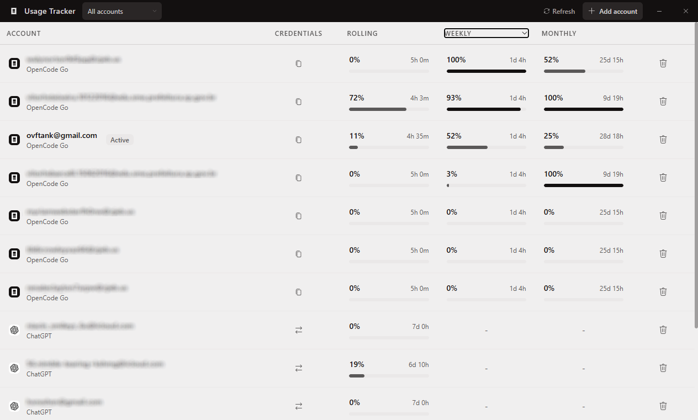

# Usage Tracker

**Desktop app to monitor ChatGPT & OpenCode Go usage. No Electron. No bloat.**

 

---

## Install

## Roadmap

- [x] ChatGPT OAuth support
- [x] OpenCode Go support
- [ ] Linux & macOS support
- [ ] Grok auth support
- [ ] Z.ai auth support
- [ ] Kimi auth support
